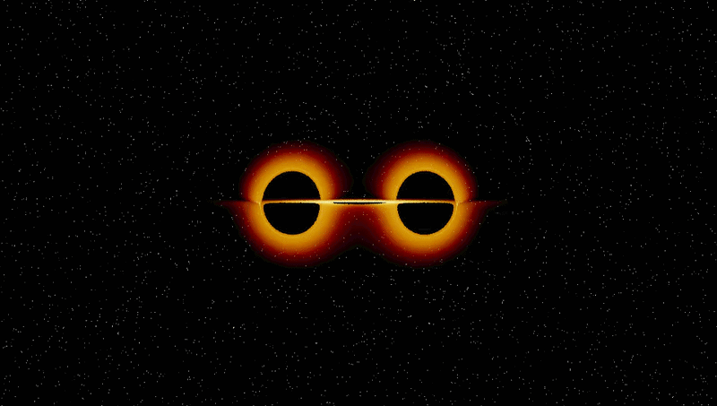

# General Relativistic Ray Tracing

GPU Accelerated General Relativistic ray tracing around a binary black hole system with blackbody thin accretion disks and doppler brightening.

## Features
- Superposed Schwarzschild geodesic integration (RK4)
- Adaptive step size for accurate disk crossing detection
- Doppler brightening and gravitational redshift
- ACES tone mapping and gamma correction
- ~15s render at 960×540, SPP=4 on an NVIDIA T4

## Roadmap
- [ ] Develop in C++/CUDA
- [ ] Inspiral animation
- [ ] Full radiative transfer (probably)
